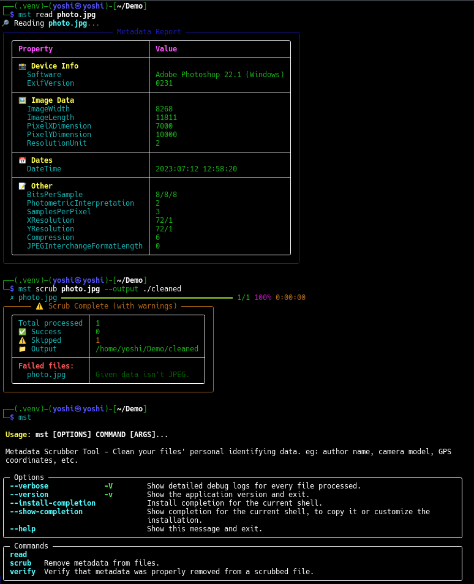

<!-- ©AngelaMos | 2026 -->
<!-- DEMO.md -->

<div align="center">

```ruby
███╗   ███╗███████╗████████╗
████╗ ████║██╔════╝╚══██╔══╝
██╔████╔██║███████╗   ██║
██║╚██╔╝██║╚════██║   ██║
██║ ╚═╝ ██║███████║   ██║
╚═╝     ╚═╝╚══════╝   ╚═╝
```

**Demo & Preview**

<br>

<a href="https://pypi.org/project/metadata-scrubber/">
  
</a>

<br>

```ruby
uv tool install metadata-scrubber
```

</div>

---

### Read, Scrub & Verify

Metadata inspection with categorized report (device info, image data, GPS, timestamps), batch scrubbing with progress bar, and post-scrub verification


